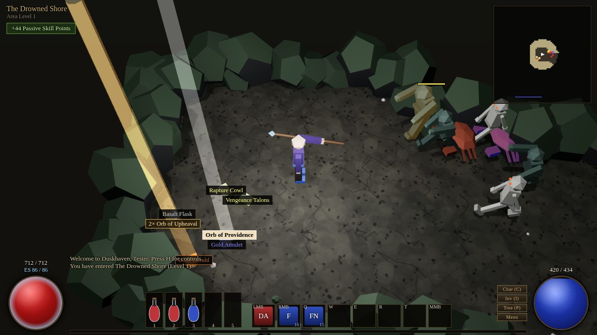
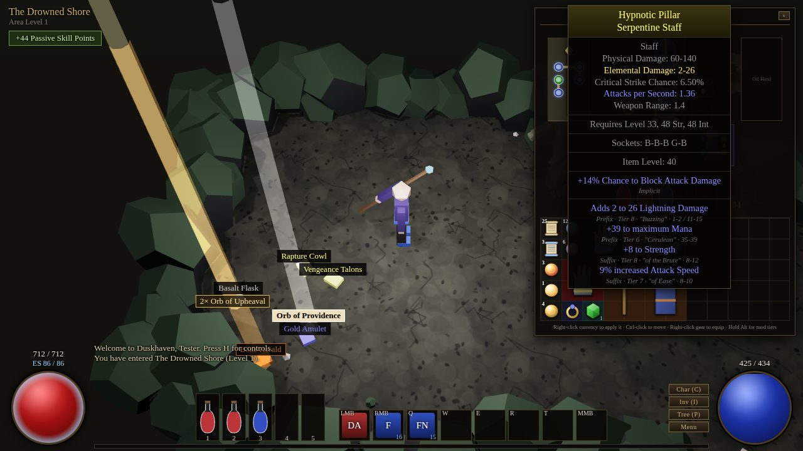
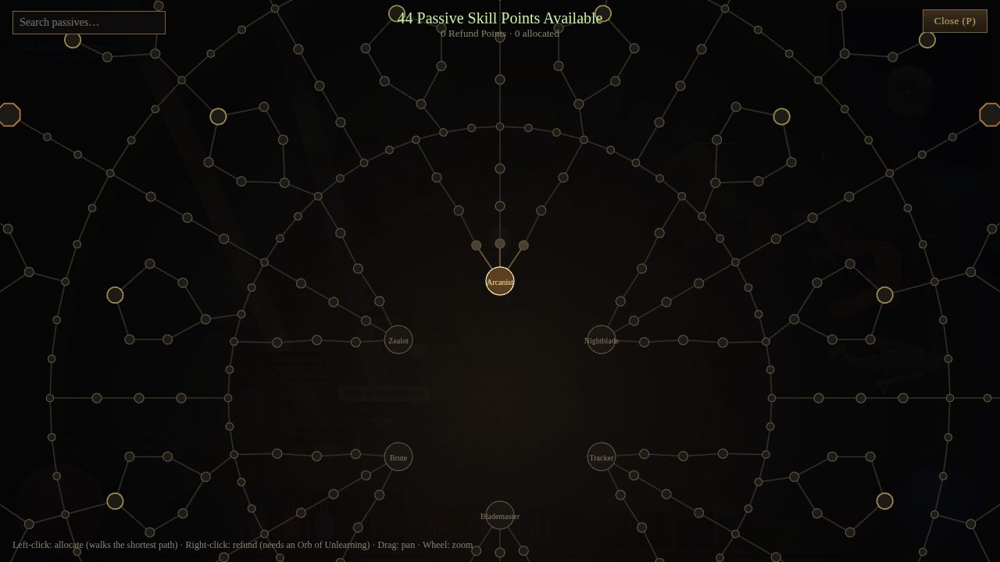

# Hollowreach

A 2.5D loot-driven action RPG built to play like **Path of Exile**: the same style of skill gem
and linked-socket system, orb-based crafting currency, tiered prefix/suffix affixes, equipment
slots, a big passive tree with keystones, resistance penalties, and an endgame of modifiable maps.

It runs in the browser (TypeScript + Three.js) with no external art assets — every model, icon and
sound is generated procedurally.



| Inventory, sockets & advanced mod view (Alt) | Passive skill tree |
| --- | --- |
|  |  |

## Play online

The `main` branch is deployed automatically to GitHub Pages:
<https://lucypigr.github.io/always-use-poe/> (`.github/workflows/deploy.yml`).

## Quick start

```bash
npm install
npm run dev        # http://localhost:5173
npm test           # unit + headless gameplay simulation tests
npm run build      # typecheck + production build into dist/
```

Progress (characters, stash, settings) is saved to `localStorage` automatically.

## Controls

| Input | Action |
| --- | --- |
| Left click | Move · pick up items · talk to NPCs · use objects (never casts a skill) |
| Right click, Space, Q W E R T, Middle click | Skill slots (hold to keep using; aimed at the cursor / monster under it). Click a skill-bar slot to change it |
| Shift + skill | Use the skill in place |

Like Path of Exile 2 you keep moving while using a skill (at 60% speed, facing the target): hold the
left button (or the joystick) and a skill key together to kite. Leap / dash / blink / flicker / cyclone
move you themselves. Turning and animation poses blend smoothly.
| J | Quest journal |
| B | Build guide (流派指南) |
| 1–5 | Drink flasks |
| I / C / P | Inventory / Character sheet / Passive tree |
| Tab | Overlay map |
| Alt (hold) | Advanced item descriptions (prefix/suffix, tier, roll range) |
| Z | Toggle ground item labels |
| Esc | Close panels / open menu |
| H | Controls & guide |
| Mouse wheel | Camera zoom |

Inventory: click to pick items up and place them (PoE-style cursor), **Ctrl-click** to move items
between inventory and stash/vendor, **right-click** gear to equip, **right-click currency** and then
click an item to apply it (hold **Shift** to keep applying). Right-click a socketed gem to unsocket it.

### Touch screens (phones / tablets)

On devices whose primary pointer is a finger the game switches to touch controls
(`src/ui/touchControls.ts`). Phones are **landscape only** (`src/ui/landscape.ts`): held upright,
the game pauses behind a "rotate your phone" screen, and in landscape the first tap enters
fullscreen (and locks the orientation where the browser allows it) so the address bar can't
shift the view. On iPhone, where web pages can't go fullscreen, add the page to the home screen.

| Touch | Action |
| --- | --- |
| Drag in the lower-left area | Virtual joystick — move |
| Tap the ground / a label | Move there · pick up / talk / use; pinch to zoom |
| Hold a round skill button (lower right) | Use the skill, auto-aimed at the nearest enemy |
| 編輯技能 then tap a slot | Change the skill in that slot |
| Flask slots | Drink |
| 地圖 · 標籤 · 回城 · 全螢幕 · 任務 | Overlay map · item labels · portal scroll · fullscreen · quest journal |
| Item toolbar (while inventory is open) | 拿取 = click · 使用 = right-click · 快速移動 = Ctrl-click · 查看 = inspect only · 詞綴階級 = Alt |
| Passive tree | Drag to pan, pinch to zoom, tap a node to inspect and tap it again to allocate / refund |

## Graphics

Rendering aims for Path of Exile's grim look (`src/render/post.ts`, `src/render/textures.ts`):
dim moonlit areas lit mainly by the hero's torch, procedural ground and rock textures with
normal maps, blood pools, drifting dust / embers, and a post-processing chain — bloom on
spells and fire, desaturated split-tone colour grading (cool in icy areas), a vignette that
acts as the light radius, film grain, and a red pulse at low life. It can be switched off in
選單 → 高畫質特效 for slower phones.

## Language

All in-game text is Traditional Chinese (繁體中文). Item, gem, currency and area names are
original names translated into Chinese.

## Story & quests

The campaign retells the first four acts of Path of Exile with this game's areas and bosses
(`src/data/quests.ts`, logic in `src/game/quests.ts`, dialogue in `src/ui/story.ts`): you are
exiled by the Empire, wash up on the Drowned Shore and take refuge in Duskhaven.

- **5 quest givers in town** (娜莎, 塔克雷, 耶娜, 克萊莉絲, 黛亞拉 — modelled on Nessa, Tarkleigh,
  Yeena, Clarissa and Dialla). `！` over a head means a new quest, `？` a reward to collect.
- **22 quests** named after PoE's: 城門前的敵人 (Enemy at the Gate), 慈悲任務 (Mercy Mission),
  打破蛋 (Breaking Some Eggs), 牢籠中的蠻獸 (The Caged Brute), 海妖的歌聲 (The Siren's Cadence),
  穿越聖地, 黑衣入侵者, 利齒與殘酷, 大白獸, 與盜匪的交易 (Deal with the Bandits), 迷失的愛,
  維多里歐的秘密, 皮耶緹的寵物, 命運的定數, 神之權杖, 狂怒之王, 不屈之魂, 永恆夢魘 and more.
- Objectives: defeat an area boss, find quest objects (gold labels), clear a number of monsters,
  or hunt **named rare monsters** that only appear while the quest is active.
- Rewards like PoE's: **pick one gem** from a list, currency, passive skill points, refund points —
  and the bandit choice: destroy all three tokens for a passive point or take one bandit lord's
  permanent blessing.
- Quest tracker under the minimap, quest journal (J), and a prologue for new characters.
  Older saves get their quests for already-beaten bosses marked ready to hand in.

## Builds (流派)

A build guide in game (**B**, or 選單 → 流派指南; data in `src/data/builds.ts`) lists 11 archetypes
modelled on popular Path of Exile builds, each with its main skill, linked supports, extra gems,
enabling uniques and keystones:

| Build | Modelled on | Key gems | Key uniques |
| --- | --- | --- | --- |
| 正義之火 | Righteous Fire Juggernaut / Chieftain | 正義之火 + 功效, 致命異常 | 卡翁之心 (Kaom's Heart), 鳳凰崛起 (Rise of the Phoenix), 不朽之軀 |
| 碎骨 | Boneshatter Juggernaut | 碎骨 + 蠻力, 粉碎 | 深淵之冠 (Abyssus), 卡翁之心 |
| 旋風斬 | Cyclone Slayer | 旋風斬 + 粉碎 | 星鑄 (Starforge), 巨獸之腹 (Belly of the Beast) |
| 閃現打擊 | Flicker Strike Berserker | 閃現打擊 + 衝擊波, 多重打擊 | 悖論之刃 (Paradoxica), 獵首者 (Headhunter) |
| 撕裂流血 | Bleed Gladiator | 撕裂 + 流血, 致命異常 | 血腥之握 |
| 閃電箭 / 龍捲射擊 | Lightning Arrow / Tornado Shot Deadeye | 風暴箭, 龍捲射擊 + 閃電穿透 | 伏特裂隙 (Voltaxic Rift), 龍牙 |
| 毒雨 | Toxic Rain Pathfinder | 毒雨 + 虛空操控, 迅速折磨 | 羽雨 (Quill Rain), 瘟疫之喉 |
| 精華吸取 | Essence Drain / Contagion Occultist | 精華吸取, 傳染 + 功效 | 虛空電池 (Void Battery), 虛空絲袍 |
| 憤怒之靈 | Summon Raging Spirits Necromancer | 召喚憤怒之靈, 召喚殭屍 + 召喚物速度 | 飲魂之面, 尤爾之骨 (Bones of Ullr) |
| 動能爆破 | Kinetic Blast Elementalist | 動能爆破 + 多重投射 | 星落動能 |
| 冰凍脈衝 | Freezing Pulse Hierophant | 冰凍脈衝 + 冰冷穿透 | 霜縛之心 |

New mechanics behind them: Righteous Fire (burns enemies and yourself by % of life + ES),
Flicker Strike (teleport-strike), Cyclone (spin while moving), temporary / per-skill-capped
minions (raging spirits, zombies), Headhunter (steal a rare monster's modifiers for 20 s),
skill-specific ailment duration (Swift Affliction) and socketless items (Kaom's Heart).

## Systems (and how they map to Path of Exile)

### Items
- **Rarities**: Normal, Magic (1 prefix + 1 suffix), Rare (up to 3 + 3), Unique (fixed mods).
- **90 random affixes** (50 prefixes, 40 suffixes — including flask and map mods) plus 30 implicits and 12 corruption implicits, each with **tiers gated by item level** and per-tier
  weights; one mod per mod group; spawn tags restrict mods to fitting bases (e.g. `+% increased
  Armour` only on armour bases, flat added damage scaled up on two-handers).
- **Required level** follows the highest mod (80% of its item level), like PoE.
- **Local vs global mods**: weapon `% increased Physical Damage`, added damage, attack speed and crit
  modify the weapon itself; armour mods modify the piece's Armour/Evasion/Energy Shield.
- **Implicits** on bases (rings, amulets, belts, quivers, wands, daggers, staves…), **quality**,
  **corruption** (with corrupted implicits and white sockets), **unidentified** drops.
- **320+ bases**: 12 weapon classes, 6 defence types × 5 armour slots × 6 tiers, jewellery, quivers,
  life/mana/hybrid/utility flasks (with flask prefixes/suffixes), and **maps**.
- **49 uniques** with build-enabling mechanics (Kaom's Heart, Headhunter, Starforge, Quill Rain, Rise of the Phoenix…) (a 6-link white-socket robe, a keystone chest, +1
  projectile bow, minion wand…).

### Currency (original names, familiar behaviour)

| In Hollowreach | Path of Exile equivalent | Effect |
| --- | --- | --- |
| Scroll of Insight | Scroll of Wisdom | Identify |
| Portal Scroll | Portal Scroll | Portal to town, return to the same instance |
| Orb of Awakening | Transmutation | Normal → Magic |
| Orb of Accretion | Augmentation | Add a mod to a magic item |
| Orb of Flux | Alteration | Reroll a magic item |
| Sovereign Orb | Regal | Magic → Rare (+1 mod) |
| Orb of Transfiguration | Alchemy | Normal → Rare |
| Orb of Upheaval | Chaos | Reroll a rare item |
| Ascendant Orb | Exalted | Add a mod to a rare item |
| Orb of Purging | Scouring | Remove all mods |
| Orb of Severance | Annulment | Remove a random mod |
| Orb of Providence | Divine | Reroll mod values |
| Orb of Grace | Blessed | Reroll implicit values |
| Prismatic Orb | Chromatic | Reroll socket colours |
| Setter's Orb | Jeweller's | Reroll socket count |
| Orb of Binding | Fusing | Reroll socket links |
| Abyssal Orb | Vaal | Corrupt (unpredictable outcomes) |
| Gambler's Orb | Chance | Normal → random rarity, may become unique |
| Tempering Stone / Plating Scrap / Glazier's Bead / Lapidary's Prism | Whetstone / Scrap / Bauble / GCP | Quality |
| Orb of Unlearning | Regret | Passive refund point |

### Gems, sockets and links
- **52 active skills** (incl. 17 auras & heralds) (melee strikes, cleaves, slams, leap/dash movement, bow skills, fireball,
  novas, chaining lightning, erratic sparks, meteor-style rains, minions, blink, and reserved auras)
  and **45 support gems** (volley, pierce, chain, fork, multistrike, echo, elemental focus,
  controlled ruin, concentrated effect, added damage, penetration, efficiency, minion supports…).
- Supports only affect active gems in **linked sockets** and only if the skill has matching
  **tags** (a projectile support won't support a melee strike). Supports add **mana multipliers**.
- Socket **colours** follow the item's attribute requirements (red/green/blue), with rare white sockets.
- Gems have level/attribute requirements, **gain experience**, and show a *level up* button when ready
  (you choose when to level). Quality gives per-gem bonuses. `+level` mods boost socketed gems.
- Auras **reserve mana** and are toggled from the skill bar.

### Auras, heralds and the crafting bench
- **Auras** (toggle from the skill bar, reserve mana): 壁壘 (Determination), 灰燼之怒 (Anger), 寒冬之握
  (Hatred), 雷霆之怒 (Wrath), 迅捷光環 (Haste), 優雅 (Grace), 紀律 (Discipline), 元素淨化 (Purity of
  Elements), 活力 (Vitality), 精準 (Precision), 清明光環 (Clarity), 狂熱 (Zealotry), 驕傲 (Pride), 惡意 (Malevolence).
- **Heralds** (25% reservation): 冰霜先驅 — chilled / frozen enemies shatter and explode; 灰燼先驅 — kills
  ignite nearby enemies; 雷霆先驅 — bolts strike nearby enemies every second.
- 啟蒙（輔） (Enlighten) and uniques with *reduced reservation* / *increased aura effect* (譏諷之面 Leer Cast,
  奧爾的起義 Aul's Uprising, 稜鏡守護者 Prism Guardian, 頭狼嚎叫 Alpha's Howl) let you run more auras.
- **Crafting bench** (工藝台 in town, `src/data/bench.ts`, `src/items/bench.ts`): pay currency to add one
  chosen mod (best tier allowed by item level, one crafted mod per item, removable), recolour all sockets,
  link all sockets or set the socket count. Crafted mods show in light blue.

### Character & combat
- 6 classes with different attributes and starting positions on a **~390-node passive tree**
  (small nodes, notables, attribute rings and **9 keystones**: Hollow Vessel (≈CI), Blood Pact (≈Blood Magic),
  Arcane Ward (≈MoM), Ironclad (≈Iron Reflexes), Unerring Discipline (≈Resolute Technique), Phantom Step,
  Elemental Overload, Close Quarters, Wrath of Ages). Allocation walks the shortest path; refunds keep the tree connected.
- **PoE modifier math**: `(base + flat) × (1 + Σincreased) × Π(more)`, damage **conversion** and
  **"gained as extra"**, per-tag scaling (spell/attack/melee/projectile/area/elemental…).
- Defences: **armour** (`A / (A + 5·D)`), **evasion** vs accuracy (PoE hit-chance formula), **block**,
  **resistances with caps and act penalties** (−20/−40/−60%), **energy shield** with recharge delay,
  life/mana **leech**, regen, penetration.
- **Ailments**: ignite, chill, freeze, shock, bleed and stacking poison; bosses resist ailment duration.
- **Flasks** with charges gained from kills and refilled in town.

### World
- Town hub (**Duskhaven**) with stash (4 tabs), vendor, crafting bench, waypoint and map device.
- **10 story areas across 4 acts**, procedurally generated (outdoor paths, cellular caves, room
  dungeons), with 17 monster types and **10 unique bosses** with telegraphed attacks.
  First kills grant a passive point and unlock the next area.
- Monster packs with **magic and rare monsters** (rare names and modifiers such as Hasted, Vampiric,
  Flame-touched), group aggro and a flow-field AI.
- **Maps**: drop from level 36+, can be crafted with currency; prefixes buff monsters, suffixes
  debuff you, and together they raise item quantity/rarity and pack size.
- Loot: rarity/quantity scaling, loot beams, coloured labels with overlap avoidance, value-based drop sounds.
- **Vendor recipes**: full rare set → Orb of Upheaval (×2 unidentified), R-G-B links → Prismatic Orb,
  6 sockets → Setter's Orbs, 6-link → Orb of Providence, quality gems/flasks → quality currency.

## Project layout

```
src/
  core/      RNG, vector math, event bus
  stats/     stat keys + modifier engine, character stat derivation
  data/      bases, affixes, uniques, currency, gems, classes, passive tree, monsters, areas, scaling curves
  items/     item model, generation, crafting (currency), grids, tooltips, rare names
  skills/    gem utilities, skill resolution (active + supports), damage calc, skill behaviours
  game/      actors, combat, monsters & AI, map generation, pathfinding, loot, vendor, equip rules, save, Game loop
  render/    Three.js scene, procedural models, particles & VFX
  ui/        HUD, panels, passive tree, tooltips, icons, input, audio, character select
tests/       vitest suites (items, stats/combat, rules, headless gameplay simulation)
```

Content is data-driven: add bases in `src/data/bases.ts`, affixes in `src/data/affixes.ts`,
uniques in `src/data/uniques.ts`, gems in `src/data/gems.ts`, monsters in `src/data/monsters.ts`
and areas in `src/data/areas.ts`. Balance curves live in `src/data/scaling.ts`.

## Notes

- Names of currencies, classes, uniques and keystones are original so the project doesn't ship
  another game's trademarks; the mechanics intentionally mirror Path of Exile.
- Not (yet) implemented: ascendancy classes, jewels, trading, vaal skills and essences. Dual-wielded
  off-hand weapons contribute their stats but attacks use the main hand.
